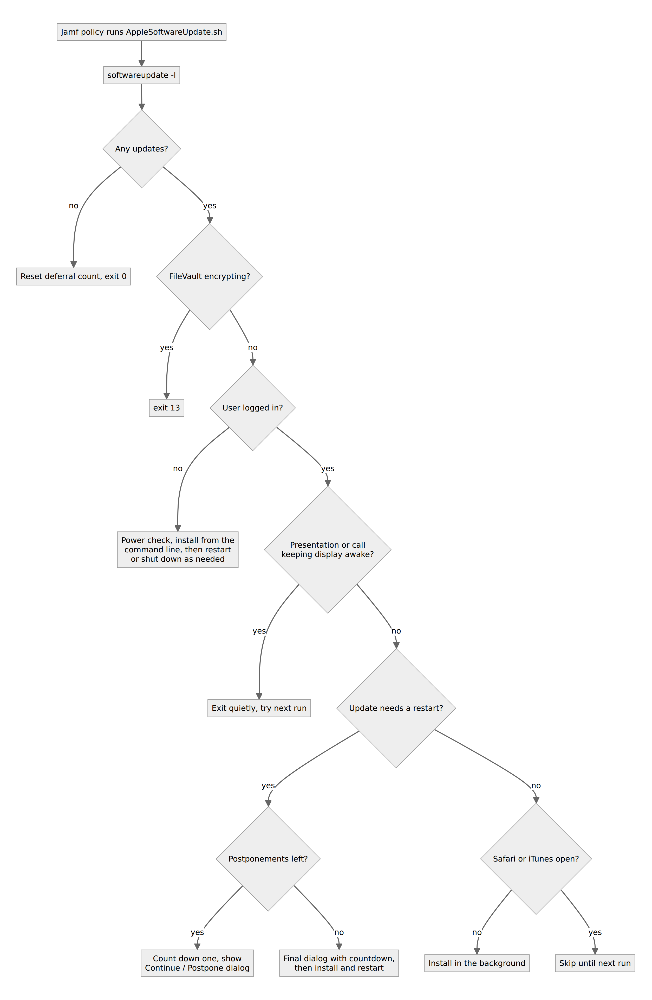

# JSS-Scripts

Shell scripts for Mac admins running Jamf Pro: prompt users through macOS updates and upgrades, reset privacy (TCC) and printing, and install Homebrew without admin rights.



*How `AppleSoftwareUpdate.sh` decides what to do on each run. Drawn from the script's code and header comments.*

  -orange)

This is a fork of [bp88/JSS-Scripts](https://github.com/bp88/JSS-Scripts) by Balmes Pavlov. Almost every script here is his work. This fork adds one folder, `homebrew.sh-master/`, and a licence file. It has not been synced with upstream since 2020, so upstream has newer versions (see [Status](#status-limits-and-real-results)).

## What it does

- **`AppleSoftwareUpdate.sh`** checks `softwareupdate -l`, installs updates silently when nobody is logged in, and gives logged-in users a set number of postponements (default 3) before a forced, counted-down update.
- **`JamfDeprecationNotifier.sh`** nags users on an unsupported macOS version to upgrade, getting firmer across optional start, nag and end dates, then hands off to an upgrade policy you name.
- **`OS_Upgrade.sh`** runs `startosinstall` from a macOS installer app (Sierra to Catalina), with power, disk space and FileVault checks and a FileVault authenticated restart.
- **`TCC.db Modifier.sh`** grants an app a TCC permission such as camera or microphone by writing to the user's `TCC.db`. **`tcc_reset.sh`** resets every TCC service one by one with `tccutil`.
- **`ResetPrintSystem.sh`** stops CUPS, backs up and resets its config, and removes all printers.
- **`jamfHelperScreen.sh`** shows a Jamf Helper dialog (full screen, HUD or utility window) from policy parameters.
- **`com.company.reconafterupdate`** is a LaunchDaemon that runs `jamf recon` once after an OS update, then removes itself.
- **`homebrew.sh-master/homebrew-3.2.sh`** installs Homebrew for the logged-in user without giving them admin rights (by Richard Purves and Tony Williams).

## Quick start

You need a Jamf Pro server and Macs enrolled in it. The scripts call Jamf Helper at `/Library/Application Support/JAMF/bin/jamfHelper.app`, which the Jamf agent installs.

```bash
git clone https://github.com/casareanderson/JSS-Scripts.git
cd JSS-Scripts
bash -n AppleSoftwareUpdate.sh && echo "syntax ok"
```

Then, in Jamf Pro:

1. **Settings > Computer Management > Scripts > New.** Paste the script and fill in the parameter labels from its header comment.
2. Add the script to a policy, set the parameter values, and scope it to a small test group first.
3. Run the policy on a test Mac and read the policy log. Each script prints what it decided and exits with a documented code.

## Usage

Every script reads Jamf script parameters `$4` onwards. The header of each file lists them in full. Two examples:

| Script | Parameters (from the header) |
|---|---|
| `AppleSoftwareUpdate.sh` | `$4` postponements allowed (default 3), `$5` seconds the dialog stays up (default 900), `$6` IT contact text (default "IT"), `$7` custom icon path |
| `TCC.db Modifier.sh` | `$4` full path to the app, e.g. `/Applications/Firefox.app`, `$5` TCC service, e.g. `kTCCServiceCamera` |

The LaunchDaemon is used by deploying it to `/Library/LaunchDaemons/` before an update. It runs every 60 seconds and calls `jamf recon` once `SystemVersion.plist` shows a date from today.

## Configuration

Most settings are Jamf parameters, shown above. A few are variables at the top of the scripts that you edit before uploading:

| Where | Variable | What it does |
|---|---|---|
| `jamfHelperScreen.sh` | `it_contact` | Contact shown in the dialog. Ships as `IT@contoso.com`, so change it. |
| `JamfDeprecationNotifier.sh` | `MaxDeferralAttempts`, `MaxIdleTime`, `MoreInfoURL`, `DelayOptions` | Deferrals after the end date, idle cut-off, the "More Info" link, and the delay choices offered |

## How it works

Each script is standalone. Jamf Pro runs it as root with your parameters. Scripts that talk to the user call Jamf Helper. Scripts that need to run something as the user use `launchctl asuser`.

```
.
├── AppleSoftwareUpdate.sh          # deferrable software updates
├── JamfDeprecationNotifier.sh      # staged "please upgrade" notices
├── OS_Upgrade.sh                   # startosinstall wrapper with FileVault restart
├── TCC.db Modifier.sh              # grant one TCC service to one app
├── tcc_reset.sh                    # reset all TCC services
├── ResetPrintSystem.sh             # reset CUPS and remove printers
├── jamfHelperScreen.sh             # generic Jamf Helper dialog
├── com.company.reconafterupdate    # LaunchDaemon: recon once after an update
└── homebrew.sh-master/             # Homebrew without admin (Apache-2.0)
```

Exit codes are listed in each header. For example, `AppleSoftwareUpdate.sh` exits 11 (no power), 12 (update failed), 13 (FileVault still encrypting), 14 (bad deferral type) and 15 (not enough disk space).

## Status, limits and real results

- **Not tested here.** No script in this fork has been run against a Mac as part of this README. The only check made (8 October 2026) is `bash -n`, which passes for every script.
- **Old macOS.** The scripts target macOS 10.12 to 10.15. `tcc_reset.sh` reads the minor version number and `OS_Upgrade.sh` expects the Catalina-era installer, so expect changes for macOS 11 and later and for Apple silicon.
- **Upstream has moved on.** [bp88/JSS-Scripts](https://github.com/bp88/JSS-Scripts) has later fixes, including Apple silicon support, and scripts this fork lacks (`OSUpdateNotifier.sh`, `Trigger_Validation_For_macOS_Installer.sh`). Use upstream for anything current.
- **Homebrew script.** It finds the console user with `/usr/bin/python`, which Apple removed in macOS 12.3. The file also starts with a UTF-8 byte-order mark before `#!/bin/bash`, which can stop the shebang being read. Fix both before use.
- **TCC writes.** Writing to `TCC.db` needs Full Disk Access for whatever runs the script, and Apple can block it in any release. The script's own header says as much.

## Licence and credits

- Scripts by **Balmes Pavlov** ([bp88](https://github.com/bp88)), from [bp88/JSS-Scripts](https://github.com/bp88/JSS-Scripts). The upstream repository has no licence file.
- This fork has an MIT [LICENSE](LICENSE) file, added in 2026.
- `homebrew.sh-master/` is by Richard Purves and Tony Williams ([Honestpuck/homebrew.sh](https://github.com/Honestpuck/homebrew.sh)), under the Apache License 2.0 in [its own LICENSE](homebrew.sh-master/LICENSE).
- `TCC.db Modifier.sh` credits a Stack Overflow answer for building the csreq blob. `tcc_reset.sh` credits a gist by haircut. `OS_Upgrade.sh` credits @dwshore for the quit-all-apps function.
